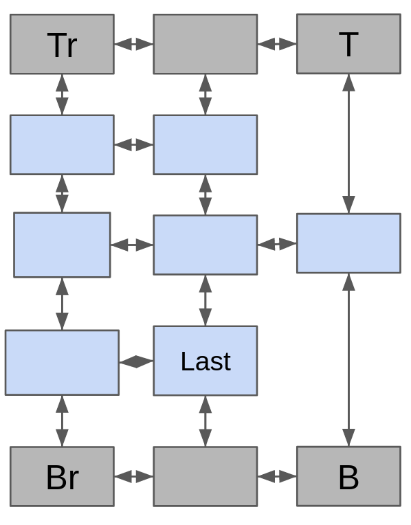
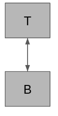
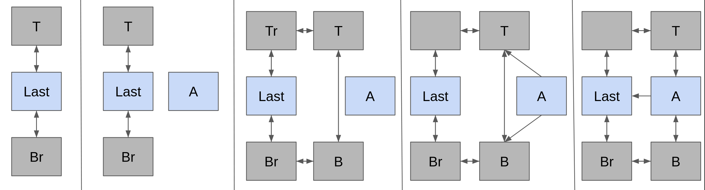

---
{}
---

## Description

Libjustify is a simple library that wraps the printf() family of functions and offers a new family: `cprintf()` that emulates their behavior while automatically justifying and formatting output to create a table.


---
### Contents:

1. [Getting Started](#Getting%20Started)
2. [Structure ](#structure)
3. [Algorithm](#algorithm)
4. [Reference](#reference)


---
## Getting Started

Libjustify offers 4 new [Functions](#functions) that are used with the same syntax as their `printf()` equivalents.

#### Functions

| Standard Function | Equivalent | Description |
|----------|-------------|--------------|
| `printf()` | `cprintf()` | Writes formatted tabulated data to the standard output stream (`stdout`). |
| `fprintf()` | `cfprintf()` | Writes formatted tabulated data to the specified output stream. |
| `vprintf()` | `cvprintf()` | Accepts a `va_list` argument instead of a variable number of arguments. |
| `vfprintf()` | `cvfprintf()` | Accepts a `va_list` argument and writes formatted tabulate output to the specified output stream. |

These format strings and store them as ([Atoms](#atoms)). ==To finally print and free all the data you must call `cflush()`==. Format strings are tabulated and justified to the width of the longest conversion specifier/text in that row.

==**NOTE: `cflush()` should always be called before program termination**==. Calls to `cflush()` will reset how future formatted data is justified.

#### Example:
```C
#include "cprintf.h"
int main() {
	cprintf("%0d | %d | %p | %s \n", 0, 1024, main, "Lorem Ipsum");
	cprintf("%0d | %.4f | %hx | %c \n", 0, 3.1415, 256, 'x');
	cflush();
}
```

**Output (`STDOUT`):**
```
0 |   1024 | 0x401276 | Lorem Ipsum
0 | 3.1415 |      100 |           x
```

---
#### Atoms:
Atoms represent a segment of the format string (and after manipulation the output) and are created by parsing format strings.

When atoms are created they come in 3 general varieties:

| Atom Type             | Description                                        |
|-----------------------|----------------------------------------------------|
| Conversion Specifiers | Represent a Conversion Specifiers storing extracted Flags, field width, precision, length modifier, format, etc  |
| Plain Text            | Stores a plain text string                                                                                   |
| Dummies               | Empty Atoms that store only navigation pointers. [Dummy Rows & Atoms. Creating dummies & inserting the first atom](#Dummy%20Rows%20&%20Atoms.%20Creating%20dummies%20&%20inserting%20the%20first%20atom)

All Atoms are also nodes for a 2D doubly linked list  [Structure](#structure)

## Structure

Atoms are nodes within a 2D linked list like graph.
This 2D linked list contains a top and bottom row of dummies which are accessible through navigation or through `dummy_rows` a [**`dummy_rows_ds`**](#**`dummy_rows_ds`**)structure that holds helpful pointers to the corners of the dummy rows / graph
*Example structure:*

**Tr=top_root  T=Upper
Br=bot_root  B=Lower

---
#### Dummy Rows & Atoms. Creating dummies & inserting the first atom
Dummy atoms are distinct from regular atoms in that they are created as necessary within `create_atom` by calling `_extend_dummy_rows()` . When dummies are first created or extended, top and bottom dummy atoms in the same column will always link bidirectionally upwards and downwards. When the first atom is created the dummy rows will be automatically created with 1 atom and it will be linked to it. Dummies are accessible through navigation or through `dummy_rows` a [`dummy_rows_ds`](#dummy_rows_ds)

##### Visualization
**Extending the first dummies**

**Inserting the first atom**:


#### Inserting and extending
Dummy rows automatically extend if the last atom in the current row of dummies is the bottom dummy or it has no right pointer:


---
#### Inserting more atoms
##### Typical Insertion
Inserting a typical atom follows the following algorithm:
**1)** Find and connect to whatever bottom dummy the new atom should connect to:

   - If this is a newline this is `dummy_rows->bottom_root`
   - Otherwise this is `last_atom_on_last_line->down->right`
**2)**  Connect to the bottom dummies upper link.

   - new_atom->up = new bottom dummy->up
**3)** Create bidirectional links for top and bottom.
**4)** Connect left to the last atom and set the new atom to last.

<figure>
  
  <figcaption>Regular insertP1</figcaption>
</figure>

##### Newline
Newlines will set bidirectional links with the dummy root and upwards with the last dummy.

---
## Algorithm

libjustify's algorithm can be broken down into 3 major parts:

#### 1) Parsing format strings and creating atoms.
Every time a format string is given to any variant of `cprintf()` it is handled by an internal
function: `_cprintf()` [`_cprintf()`](#_cprintf()).  `_cprintf()` adds a row of atoms that act as an internal representation of that format string. See [Atoms](#atoms), [Dummy Rows & Atoms. Creating dummies & inserting the first atom](#Dummy%20Rows%20&%20Atoms.%20Creating%20dummies%20&%20inserting%20the%20first%20atom) and [Inserting more atoms](#inserting-more-atoms) for details on atoms and the creation and insertion of atoms.

---
#### 2) Calculating the widest atom in every column
Calling [`cflush()`][#cflush()] initiates a tabulation and output sequence. This sequence begins with [`calc_max_width()`][#calc_max_width()] which traverses the structure walking down the columns starting at the `top_root` and finding which of the atoms has the largest field width. The largest field width then gets stored in atoms in this column as `new_field_width`.

---
#### 3) Generating new field widths
Calling [`cflush()`][#cflush()] initiates a tabulation and output sequence. The second step in this sequence calls  [`generate_new_specs()`][#generate_new_specs()] which uses the previously stored values for the minimum field width and creates a new format string specification based on the stored flags, width, etc.

---
#### 4) Output

The stored data structure is then traversed by  [`print_something_already()`][#print_something_already()] which will traverse down each column printing them appropriately based on their new specification (found in the last step)

---
## Reference

#### dummy_rows_ds
`dummy_rows_ds` contains automatically set pointers to corners of the upper and lower dummy rows to ease traversal and extension of the dummy rows .

| Type    | Name | Description                                                 |
| --- | --------------- | ----------------------------------------------------------- |
| atom *   | upper           | Holds the rightmost dummy atom in the top dummy atom row    |
| atom *   | lower           | Holds the rightmost dummy atom in the bottom dummy atom row |
| atom *   | bot_root        | The leftmost dummy atom in the bottom dummy atom row        |
| atom *  | top_root        | The leftmost dummy atom in the top dummy atom row           |

---

#### calc_actual_width

**SPEC:**`static voidcalc_actual_width( struct atom *a )`

`calc_actual_width` identifies conversion specifiers storing the respective width after applying any appropriate flags, width modifiers, lengths, etc. finally storing the atom type `a->type` and its passed value into `a->val`.

---
#### `_extend_dummy_rows`

**SPEC:** `void calc_max_width(size_t size);`

`_extend_dummy_rows` extends the upper and lower dummy rows by a given `size` linking upper and lower dummy rows to each other [Inserting and extending](#Inserting%20and%20extending) and in the process automatically updating `dummy_rows`.

---
#### calc_max_width()

**SPEC:** `void calc_max_width();`

`calc_max_width()` calculates the widest field width within each column and stores it's width within all the other atoms in that column.

Details:
`calc_max_width()` starting at the [Dummy Rows. Creating dummies & inserting the first atom](#dummy-rows-creating-dummies-inserting-the-first-atom), walks down each column twice finding the width of the largest atom in that column (`atom->original_field_width`) before walking down the column again storing the largest width found in `atom->new_field_width` .

---
#### generate_new_specs()

**SPEC:** `void generate_new_specs();`

`generate_new_specs()` generates new format strings for each atom that contain the calculated minimum width fields for each column (computed by [`calc_max_width()`](#calc_max_width()) writing them to `atom->new_specification`.

Details:
`generate_now_specs` walks down each column calling `snprintf()` using the atoms parsed conversion specifications

##### Snippet
```C
rc = snprintf(buf, 4099, "%%%s%zu%s%s%s",
		citer->flags,
		citer->new_field_width,
		citer->precision,
		citer->length_modifier,
		citer->conversion_specifier);
```

---
#### \_cprintf()

**SPEC:** `void _cprintf( FILE *stream, const char *fmt, va_list *args );`

The `_cprintf()` function sequentially processes format strings segmenting them by identifying 3 types:
1. Newlines
2. Plain text
3. Conversion specifiers.

Upon segmentation `_cprintf()` generates a corresponding atom that is processed based on the type.

In handling conversion specifiers, `_cprintf()` ensures all elements - flags, field width, precision, length modifier, and type - are parsed and stored within the newly minted atom.

**In summary: `_cprintf()` analyzes a format string and constructs a unique row of atoms.**

---
#### print_something_already()

**SPEC:**`void print_something_already()`

`print_something_already()`
traverses down each column printing each atoms new calculated specification to the output buffer.

---
#### cflush()

**SPEC:** `void cflush( );`

The `cflush()` function initiates a routine that [calc_max_width() ](#calc_max_width) before generating and storing new justified specifications within every atom. The newly modified structure is then printed to the specified output stream and the entire data structure is freed.

**NOTE:** `cflush()` will reset the desired output stream and how future formatting strings are justified.

##### Internal Snippet:
```C
void
cflush(){
    if( NULL != origin){ //Chucks if the data structure is empty
	    calc_max_width();
	    generate_new_specs();
	    print_something_already();
	    free_graph();
	}
	dest = NULL; //Free output stream.
}
```

`cflush()` will also free the data structure, forgetting any previously assigned output streams and resetting how future format strings are tabulated.

##### Example
```C
cprintf("%0d | %d | %p |\n", 0, 1024, main);
cprintf("%0d | %.4f | %hx | %c \n", 0, 3.1415, 256, 'x');
cflush();

printf("\nFlushed\n\n");

cprintf("%0d | %d | %s | %s \n", 128, 2, "Lorem ipsum dolor", "sit amet");
cprintf("%x | %.2f | %hx | %c \n", 0xC0FFEE, 3.14, 256, 'x');
cflush();
```

**Output (`STDOUT`):**
```
0 |   1024 | 0x401286 |
0 | 3.1415 |      100 | x

Flushed

000128 |    2 | Lorem ipsum dolor | sit amet
c0ffee | 3.14 |               100 |        x
```
---
#### `_make_dummy()`

**SPEC:**`struct atom *_make_dummy( void )`

`_make_dummy()` creates and returns an entirely empty dummy atom.
